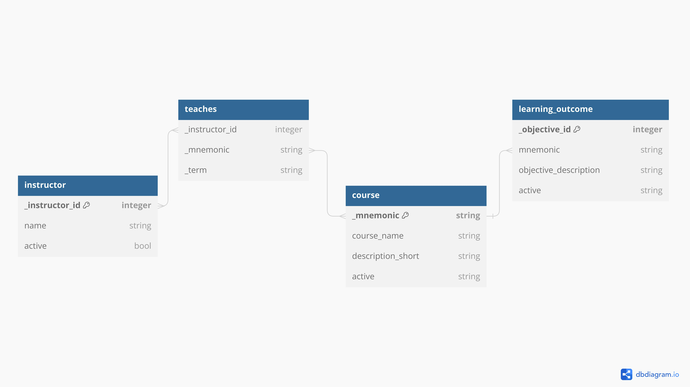
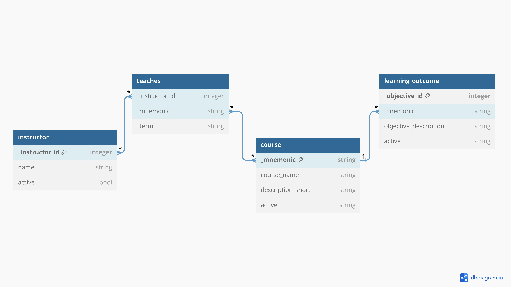

# DS5111_Database_Design

## PART 1
Part 1 of the assignment is to understand the problem and design the database.
You will then answer the following Design Questions and submit your responses.

### 1) (3 PTS) What tables should you build?

- Table 1: `courses` - This table stores all course information which has a relation to learning outcomes and what is being taught and by whom.
- Table 2: `instructors` - This table stores all instructor information which has a relation to what is being taught.
- Table 3: `learning_outcomes` - This table stores all learning outcomes which have a relation to courses.
- Table 4: `teaches` - This table stores what is being taught, by whom, and when.

### 2) (2 PTS) For each table, what field(s) will you use for primary key? 

- Table 1: `course`s - The `_mnemonic` of the course.
- Table 2: `instructors` - A unique `_instructor_id` since names can potentially be the same.
- Table 3: `learning_outcomes` - A unique `_objective_id`.
- Table 4: `teaches` - A combination of the `instructor_id`, course `_mnemonic`, and `_term`.

### 3) (2 PTS) For each table, what foreign keys will you use?

- Table 1: `courses` - The `_mnemonic` of the course will be used as a foreign key in the `teaches` table.
- Table 2: `instructors` - The `_instructor_id` of the instructor will be used as a foreign key in the `teaches` table.
- Table 3: `learning_outcomes` - The `mnemonic` is a foreign key to the `courses` table
- Table 4: `teaches` - The `_instructor_id` of the instructor and `_mnemonic` of the course are both foreign keys.

### 4) (2 PTS) Learning outcomes, courses, and instructors need a flag to indicate if they are currently active or not. How will your database support this feature? In particular:

- If a course will be taught again, it will be flagged as active. If the course won’t be taught again, it will be flagged as inactive. **Adding a flag called `active` to the `courses` table.**

- It is important to track if an instructor is a current employee or not. **Adding a flag called `active` to the `instructor` table.**

- Learning outcomes for a course can change. You’ll want to track if a learning outcome is currently active or not. **Adding a flag called `active` to the `learning_outcome` table.**

### 5) (1 PT) Is there anything to normalize in the database, and if so, how will you normalize it? Recall the desire to eliminate redundancy.

- **1st order normalization:**
  - In the `instructors` and `courses` tables, each column contains atomic values, such as `_instructor_id`, `name`, `_mnemonic`, `course_name`, etc.
  - The `teaches` table appears satisfies 1NF. Each column contains atomic values of consistent data types.
  - The `learning_outcomes` table satisfies 1NF. Each column contains atomic values of consistent data types.
  - All entries in each column are of the same data type, such as integers for IDs, strings for names, and so on.

- 2nd order normalization:
  - The `instructor` table has `_instructor_id` as its primary key, and all non-key attributes (`name`, `active`) are functionally dependent on the `_instructor_id`, making it satisfy 2NF.
  - The `course` table has `_mnemonic` as its primary key, and all non-key attributes (`course_name`, `description_short`, `active`) are functionally dependent on the `_mnemonic`, making it satisfy 2NF.
  - The `teaches` table has a composite primary key (`_instructor_id`, `_mnemonic`, and `_term`) and no non-key attributes that are functionally dependent on the entire primary key. Thus, it satisfies 2NF.
  - The `learning_outcomes` table has a composite primary key (`_objective_id` and `_mnemonic`), as well as non-key attributes, including `short_description` and `active`. These non-key attributes are functionally dependent on the entire primary key, so it satisfies 2NF.

- 3rd order normalization:
  - The `instructors` and `courses` tables satisfy 3NF because they do not exhibit transitive dependencies. All non-key attributes are directly dependent on the primary key.
  - The `teaches` table appears to be in 3NF because there don't seem to be any transitive dependencies. All non-key attributes are directly dependent on the primary key (`_instructor_id` and `_mnemonic`).
  - The `learning_outcomes` table seems to be in 3NF. There does not appear to be transitive dependencies, and all non-key attributes are directly dependent on the primary key (`_objective_id` and `_mnemonic`).

### 6) (1 PT) Are there indexes that you should build? Explain your reasoning.

Yes,
- Primary Keys: Indexed primary keys allow for efficient data retrieval and data integrity enforcement.
- Foreign Keys: Index foreign keys facilitate joins between tables.
- Attributes used in WHERE Clauses: It's beneficial to index those attributes to speed up data retrieval for WHERE conditions. To be determined if this can apply to this use case.
- Attributes Used in JOIN Operations: Indexing the attributes involved in the join conditions can enhance the performance of these operations for tables that are frequently joined with other tables. To be determined if this can apply to this use case.
- Attributes with High Cardinality: Attributes with many distinct values can be indexed for efficiency. To be determined if this can apply to this use case.

### 7) (2 PTS) Are there constraints to enforce? Explain your answer and strategy.
For example, these actions should not be allowed:
- Entering learning objectives for a course not offered by the School of Data Science
- Assigning an invalid instructor to a course

Yes,
- Learning objectives should pertain to courses offered by the School of Data Science

### 8) (5 PTS) Draw and submit a Relational Model for your project. For an example, see Beginning Database Design Solutions page 115 Figure 5-28.

https://dbdiagram.io/d/ds5111_lab_database_design-65419ad07d8bbd64653c6747

### 9) (2 PTS) Suppose you were asked if your database could also support the UVA SDS Residential MSDS Program. Explain any issues that might arise, changes to the database structure (schema), and new data that might be needed. Note you won’t actually need to support this use case for the project.

No, we would need to consider room assignment and availability which makes the database more complex since we would need to track class enrollment which in turn could require a need to have a student table and track many other factor that make availability possible. Room assignment would mean we need to determine what classes are taking place at what time of the day and where so we do not have a collision.

## Part 2

After building and populating your database, you will write SQL queries to answer the questions below.
Include your SQL code and results in your submitted file.

*Note to build the databases and fix some of the formatting done by excel. `src/01-raw-data-prep.ipynb` and `src/02-raw-data-prep.ipynb` were run sequentially*

### 1) (1 PT) Which courses are currently included (active) in the program? Include the course mnemonic and course name for each.

[View `question_1.sql`](./sample_model/question_1.sql)

### 2) (1 PT) Which courses were included in the program, but are no longer active? Include the course mnemonic and course name for each.

[View `question_2.sql`](./sample_model/question_2.sql)

### 3) (1 PT) Which instructors are not current employees?

[View `question_3.sql`](./sample_model/question_3.sql)

### 4) (1 PT) For each course (active and inactive), how many learning outcomes are there?

[View `question_4.sql`](./sample_model/question_4.sql)

### 5) (2 PTS) Are there any courses with no learning outcomes? If so, provide their mnemonics and names.

[View `question_5.sql`](./sample_model/question_5.sql)

### 6) (2 PTS) Which courses include SQL as a learning outcome? Include the learning outcome descriptions, course mnemonics, and course names in your solution.

[View `question_6.sql`](./sample_model/question_6.sql)

### 7) (1 PT) Who taught course ds5100 in Summer 2021?

[View `question_7.sql`](./sample_model/question_7.sql)

### 8) (1 PT) Which instructors taught in Fall 2021? Order their names alphabetically, making sure the names are unique.

[View `question_8.sql`](./sample_model/question_8.sql)

### 9) (1 PT) How many courses did each instructor teach in each term? Order your results by term and then instructor.

[View `question_9.sql`](./sample_model/question_9.sql)

### 10a) (2 PTS) Which courses had more than one instructor for the same term? Provide the mnemonic and term for each. Note this occurs in courses with multiple sections.

[View `question_10a.sql`](./sample_model/question_10a.sql)

### 10b) (1 PT) For courses with multiple sections, provide the term, course mnemonic, and instructor name for each. Hint: You can use your result from 10a in a subquery or WITH clause.

[View `question_10b.sql`](./sample_model/question_10b.sql)
